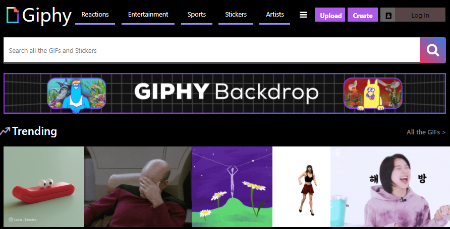

# Giphy-with-a-unique-API
A Web Application that uses search inputs and Giphy API for presenting GIFs on a webpage.

Recommendedy to use the Giphy API since you need not request for any API key to use it.
Visit the giphy.com website at https://developers.giphy.com/
CLick on Create An App and follow the instructions accodringly to get your own unique API key
We can 
1. Fetch API - Wraps fetches to the GIPHY API and returns typed response. Fetch trending, search, related, emoji and more.(Focused)
2. React SDK - UI Component library using React.
3. JavaScript SDK - UI Components you can append to the DOM.

Now we can get started
Using the html file and css stylesheet we can design the front-end of the website
Using javascript the back-end work is done like
1. Search
2. Trending
3. Related
4. Emoji
   and more
  - Focusing on only search and trending in this project
  

   
   
